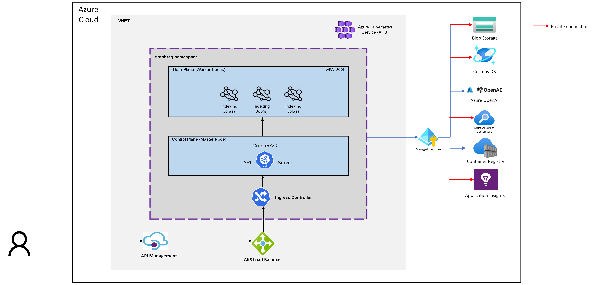

# GraphRAG Accelerator

Welcome to the GraphRAG solution accelerator! This accelerator builds on top of the [graphrag](https://github.com/microsoft/graphrag) python package and exposes API endpoints hosted on Azure, which can be used to trigger indexing pipelines and enable querying of the graphrag knowledge graph.

This repository presents a methodology for running a hosted service using knowledge graph memory structures to enhance LLM outputs. Please note that the provided code serves as a demonstration and is not an officially supported Microsoft offering.

⚠️ Warning: The GraphRAG Accelerator uses multiple Azure services and may incur substantial costs. It is meant to host a high-utilization API with auto-scaling and user access control. Please see the [deployment bicep](infra/main.bicep) for further detail on the services used.

⚠️ Warning: GraphRAG indexing can be an expensive operation. Please read all documentation to understand the process and costs involved, and start with a small amount of data.

For FAQ and our roadmap, please visit `aka.ms/graphrag`

## Getting Started with GraphRAG on Azure

### Deployment Guide
To deploy the solution accelerator, see the [deployment guide](docs/DEPLOYMENT-GUIDE.md). This will result in a full deployment of graphrag as an API.
Afterwards, check out the [Quickstart](https://github.com/Azure-Samples/graphrag-accelerator/blob/main/notebooks/1-Quickstart.ipynb) notebook for a demonstration of various API calls.

## Development Guide
Interested in contributing? Check out the [development guide](docs/DEVELOPMENT-GUIDE.md).

# Trademarks

This project may contain trademarks or logos for projects, products, or services. Authorized use of Microsoft trademarks or logos is subject to and must follow [Microsoft’s Trademark & Brand Guidelines](https://www.microsoft.com/en-us/legal/intellectualproperty/trademarks/usage/general). Use of Microsoft trademarks or logos in modified versions of this project must not cause confusion or imply Microsoft sponsorship. Any use of third-party trademarks or logos are subject to those third-party’s policies.
